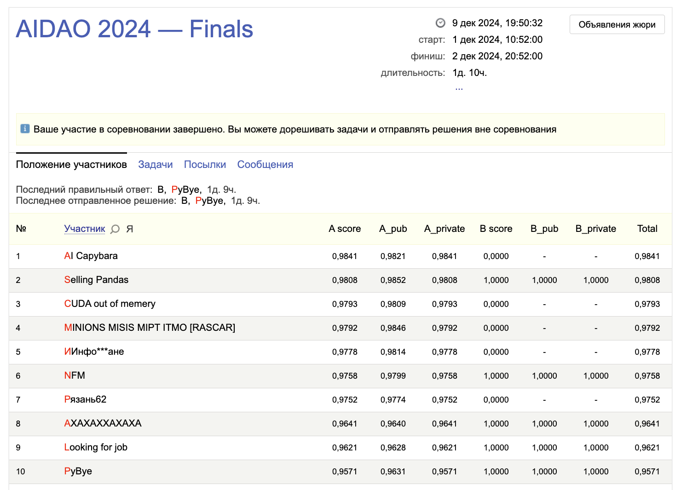

# [AIDAO](https://education.yandex.ru/aidao) — Artificial intelligence and data analysis Olympiad
## First place solution

### Key ideas:
- One backbone (efficientformer_l1 from timm)
- Separated heads for damage, fraud, side classes
- Combined binary target for ALL_GOOD class: final_label = 1 - int((fraud_label == 0) & (damage_label == 0))
- Drop inconsistent annotations
- Complex, class-specific augmentations from imgaug
- CrossEntropy losses for all heads
- CosineAnnealingWarmRestarts scheduler, AdamW optimizer

